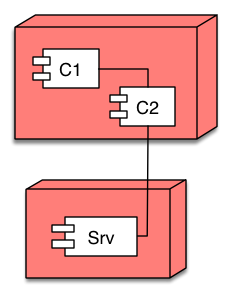

arc42 Template Overview
===

arc42 is a template for architecture communication and documentation.

arc42 answers the following two questions in a pragmatic way, but can be tailored to your specific needs:

- *What* should we document/communicate about our architecture?
- *How* should we document/communicate?

# 1. Introduction and Goals

Short description of the **requirements**, driving forces, extract (or abstract) of requirements. Top three (max five) **quality goals** for the architecture which have highest priority for the major stakeholders. A table of important **stakeholders** with their expectation regarding architecture.

[Read More...](section_1.md)

# 2. Constraints

Anything that constrains teams in design and implementation decisions or decision about related processes. Can sometimes go beyond individual systems and are valid for whole organizations and companies.

[Read More...](section_2.md)

# 3. Context and Scope

Delimits your system from its (external) communication partners (neighboring systems and users). Specifies the external interfaces. Shown from a business/domain perspective (always) or a technical perspective (optional)

[Read More...](section_3.md)

# 4. Solution Strategy

Summary of the fundamental decisions and solution strategies that shape the architecture. Can include technology, top-level decomposition, approaches to achieve top quality goals and relevant organizational decisions.

[Read More...](section_4.md)

# 5. Building Block View

Static decomposition of the system, abstractions of source-code, shown as hierarchy of white boxes (containing black boxes), up to the appropriate level of detail.

[Read More...](section_5.md)

# 6. Runtime View

Behavior of building blocks as scenarios, covering important use cases or features, interactions at critical external interfaces, operation and administration plus error and exception behavior.

[Read More...](section_6.md)

# 7. Deployment View

Technical infrastructure with environments, computers, processors, topologies. Mapping of (software) building blocks to infrastructure elements.

[Read More...](section_7.md)

# 8. Crosscutting Concepts

Overall, principal regulations and solution approaches relevant in multiple parts (→ cross-cutting) of the system. Concepts are often related to **multiple building blocks**. Include different topics like domain models, architecture patterns and -styles, rules for using specific technology and implementation rules.

[Read More...](section_8.md)

# 9. Architectural Decisions

Important, expensive, critical, large scale or risky architecture decisions including rationales.

[Read More...](section_9.md)

# 10. Quality Requirements

Quality requirements as scenarios, with quality tree to provide high-level overview. The most important quality goals should have been described in section 1.2. (quality goals).

[Read More...](section_10.md)

# 11. Risks and Technical Debt

Known technical risks or technical debt. What potential problems exist within or around the system? What does the development team feel miserable about?

[Read More...](section_11.md)

# 12. Glossary

Important domain and technical terms that stakeholders use when discussing the system. Also: translation reference if you work in a multi-language environment.

[Read More...](section_12.md)

# Further information

Now that you know about the template sections, you can dive deeper. Have a look at our extensive documentation:

- Real-world [examples](examples.md)
- FAQ - [Frequently asked questions](https://faq.arc42.org/)
- Our extensive [template documentation](https://docs.arc42.org/), organized by template section.
- Our (sketchy) [collection of software patterns](http://patterns.arc42.org/).