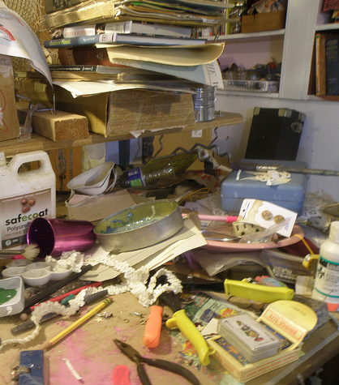

Architecture Documentation (often) Sucks
===

In real life systems we find well-written code, motivated teams and productive systems - but quite often the knowledge about software architecture is hidden in single brains, scattered code or simply lost.

Several typical problems hinder many software projects - which arc42 can help to reduce or eliminate very effiently with low effort.

### Not Existing or Outdated

The first problem is missing or outdated documentation:

 [Photo: Pablo Garcia Saldana](https://unsplash.com/photos/I9qoPr82Csg)

There’s documentation, created somewhere in the past. Rumors say it had been correct a long time ago, the original authors unknown or vanished. Such *historical* artifacts only waste disk space and provide no value at all, for nobody.

### Chaotic

The second problem is chaotic and confusing documentation.

 Such documentation has often been created without clear purpose, by various people without proper coordination.

Such *documentation anarchy* is hard to maintain and is generally considered more harmful than helpful, due to the lack of appropriate structure.

[Photo: AuntyLaurie](https://www.flickr.com/photos/auntylaurie/8239863846/)

### Too Much

You can hide any needle in a sufficiently large haystack - and nobody will be able to efficiently find it in there. Such piles of documents might seem impressive at first - unless someone tries to find (or update!) specific information.

These overflow often happens on network-shares or wikis when nobody cares about documentation structure and -content.

[Photo: Alexandre Duret-Lutz](https://www.flickr.com/photos/gadl/320300354/)

### Painful

From typical developers’ perspective, documentation is often a pain:

Formalities, inappropriate tools and formats, missing goals, unclear instructions on what and how to document. Stakeholders complaining, documentation is awkward and clumsy. Creativity gone. That’s **not** why people became developer.

[Photo: MattysFlicks](https://www.flickr.com/photos/68397968@N07/9933927445/)

# arc42 makes documentation efficient and effective

arc42 has a clear, simple and effective structure to document and communicate your software system. Is is optimized for understandability and adequacy. arc42 naturally guides you to explain any kind of architecture information or decision in an understandable way, easy to maintain.

## Painless documentation

arc42 users **like** the *understandability*, that mainly results from its standardized structure.

But what they really **love** is the *manageable effort* it takes to create and maintain arc42-based architecture documentation. We call it “*painless documentation*”, using the arc42 template does not require additional effort:

- You only describe things that your stakeholders really have to know.
- You explain facts and issues that are necessary to understand the system or individual design decisions.
- You only keep track of important architecture decision that you had to make anyhow.

## Lean and lightweight

arc42 is intended to be a lightweight tool that can easily be adapted to your specific need.